<p align="center">
  
</p>

# The Shoe Boy: Order & Inventory Management System

[](https://laravel.com)
[](https://www.php.net/)
[](https://tailwindcss.com)
[](https://alpinejs.dev)
[](https://opensource.org/licenses/MIT)
[](https://github.com/clascuna556171/shoeboy/graphs/commit-activity)

**The Shoe Boy** is a production-grade order and inventory management platform engineered with **Laravel 13**. It powers a footwear reselling business that sells imported sneakers through **Facebook live streams** and a **walk-in point-of-sale** — tracking every pair from supplier intake, through triage and reservation, to verified payment and doorstep delivery.

---

## 📸 System Previews

### Owner Executive Center
| Executive Overview & Financial Position | Financial & Profitability Reports | Security & Audit Trail |
| :---: | :---: | :---: |
| 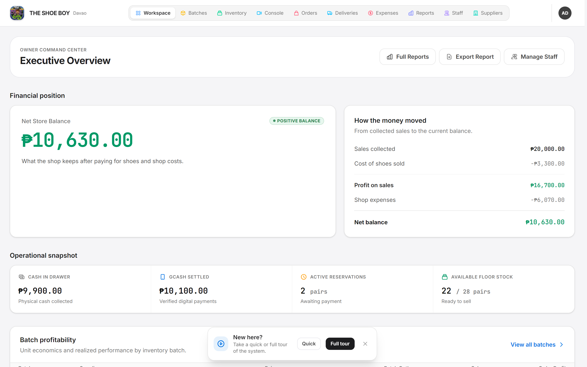 | 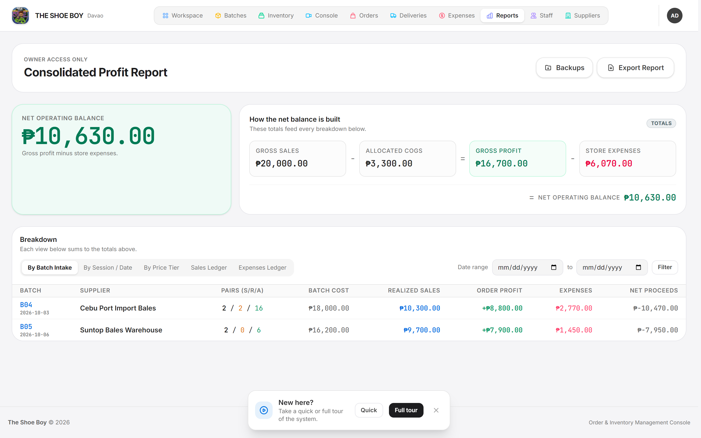 | 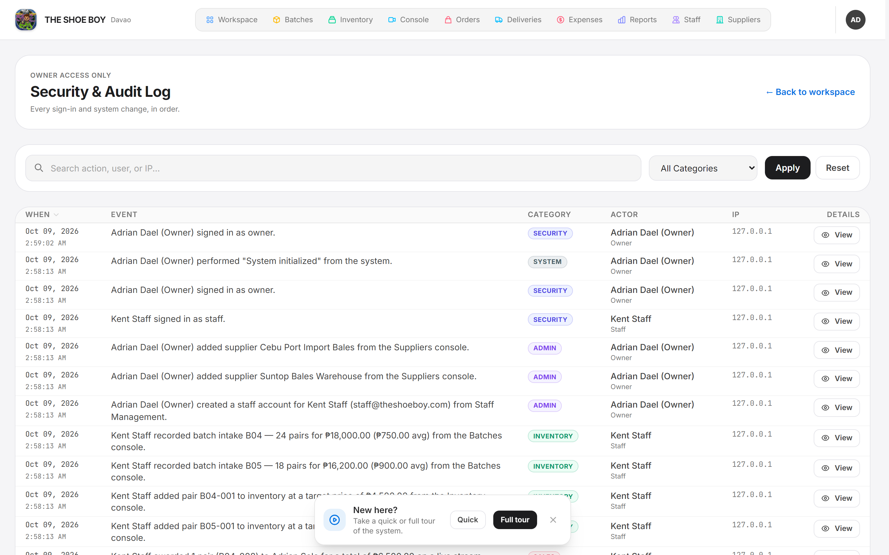 |

| Staff Account Management | Supplier Registry |
| :---: | :---: |
| 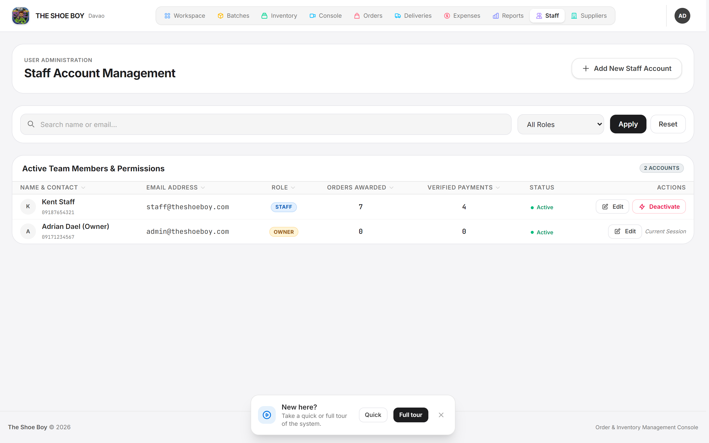 | 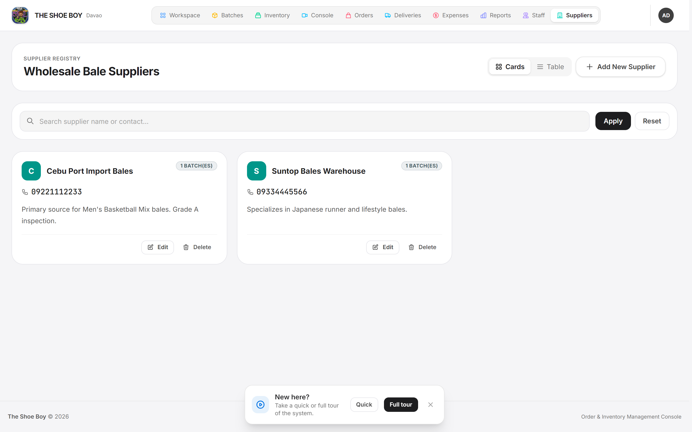 |

### Staff Workspace & Live Claims
| Live Selling Workspace | Active Claims & Reservation Countdown | Walk-in POS Checkout |
| :---: | :---: | :---: |
|  | 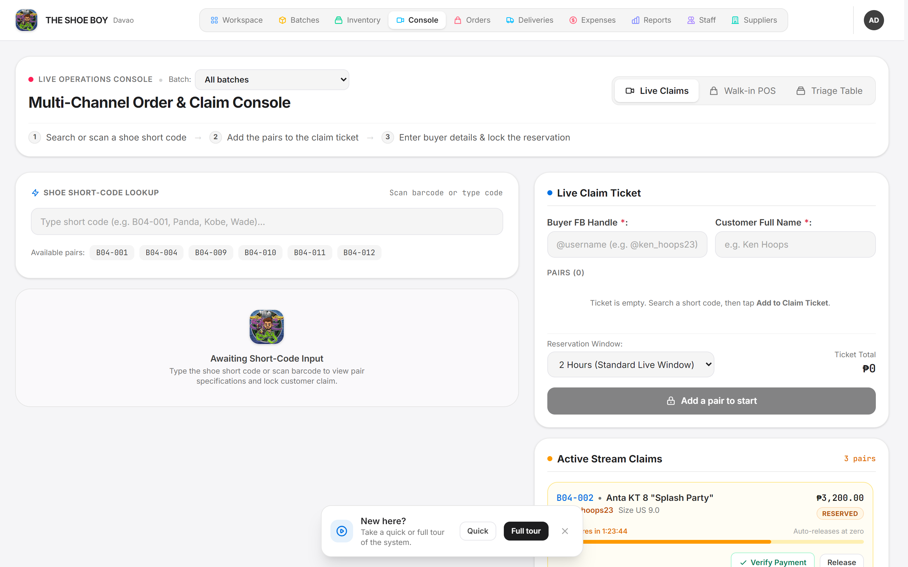 | 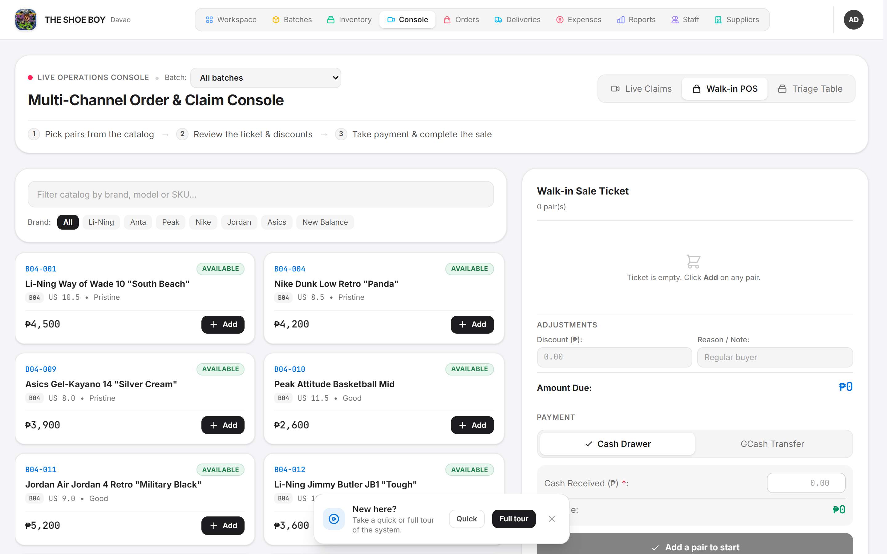 |

### Inventory & Fulfillment
| Inventory & Triage Console | Batch Intake Management | Orders Console |
| :---: | :---: | :---: |
| 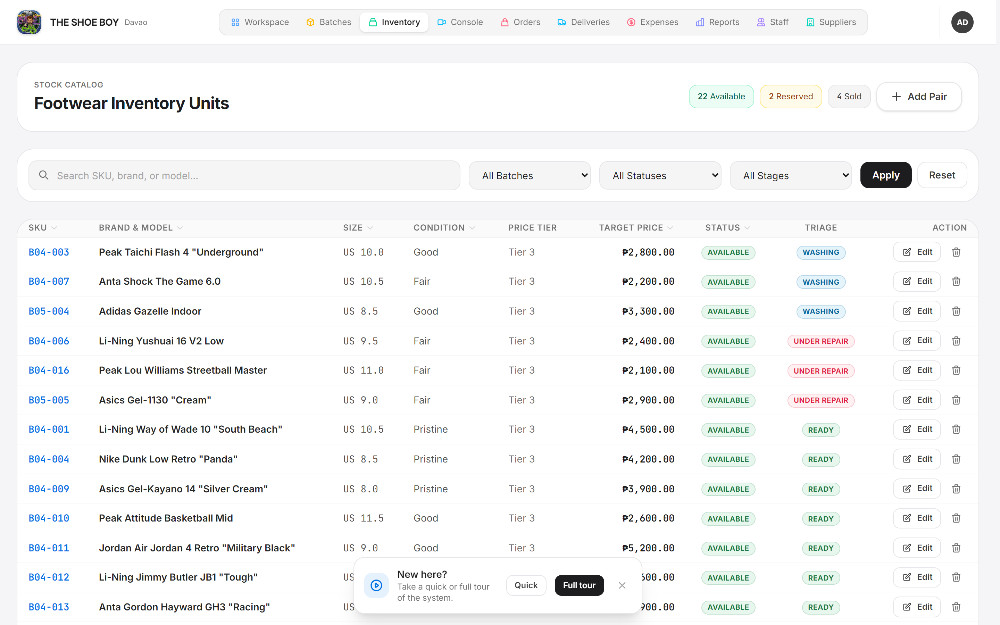 | 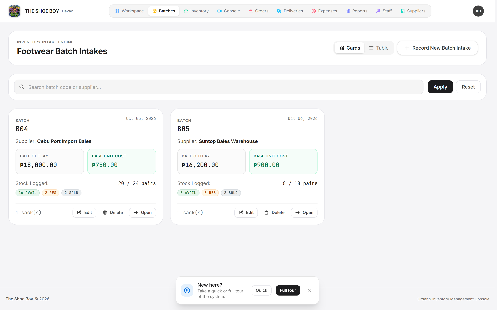 | 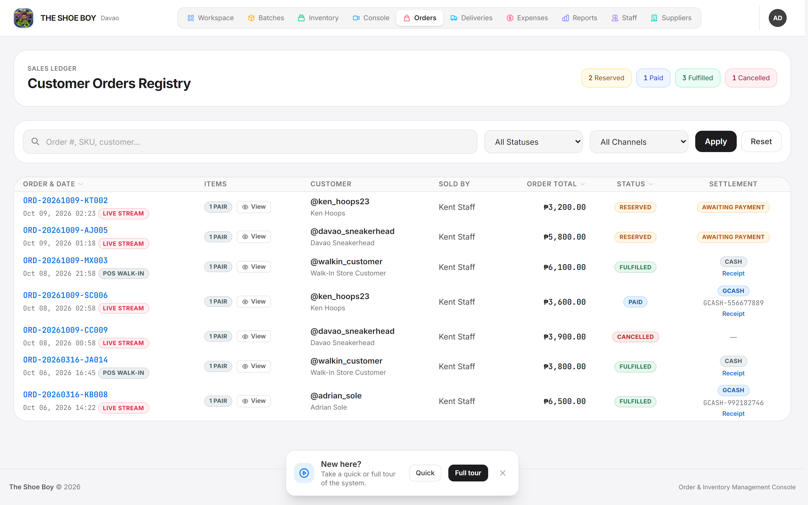 |

| Deliveries & J&T Fulfillment | Operating Expenses Ledger |
| :---: | :---: |
| 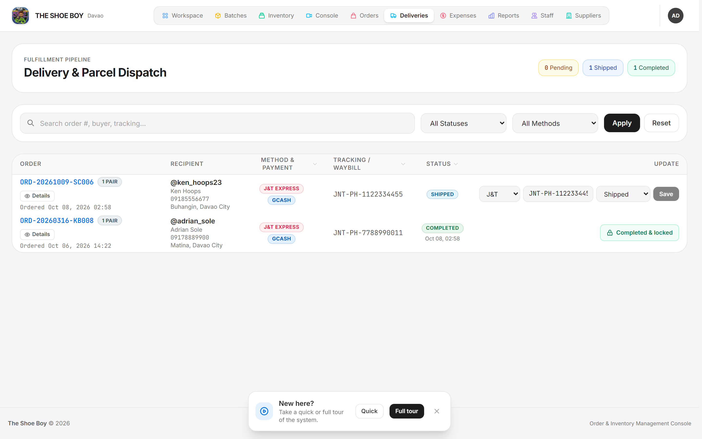 | 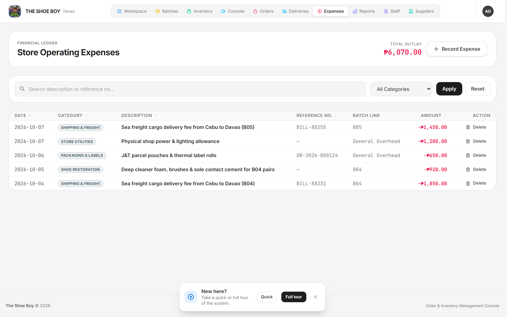 |

### Authentication & System
| Secure Sign-in | Branded Error Handling |
| :---: | :---: |
| 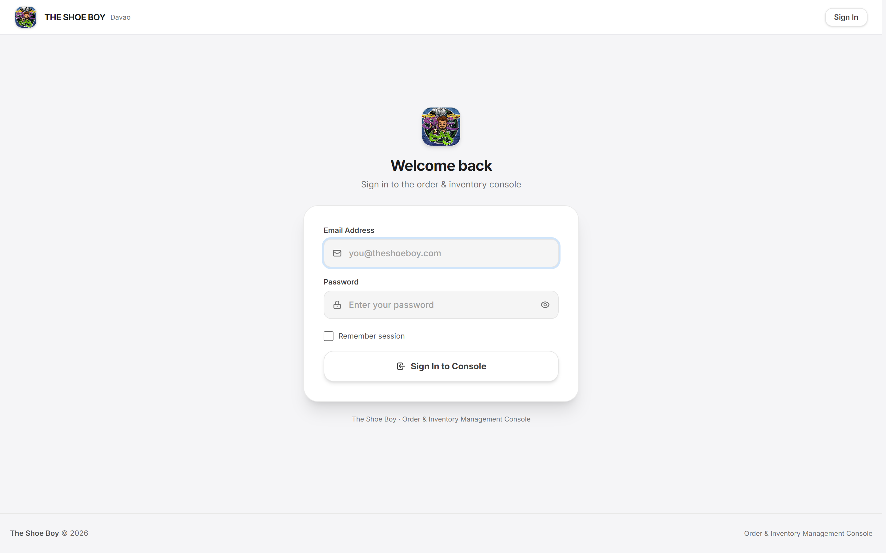 | 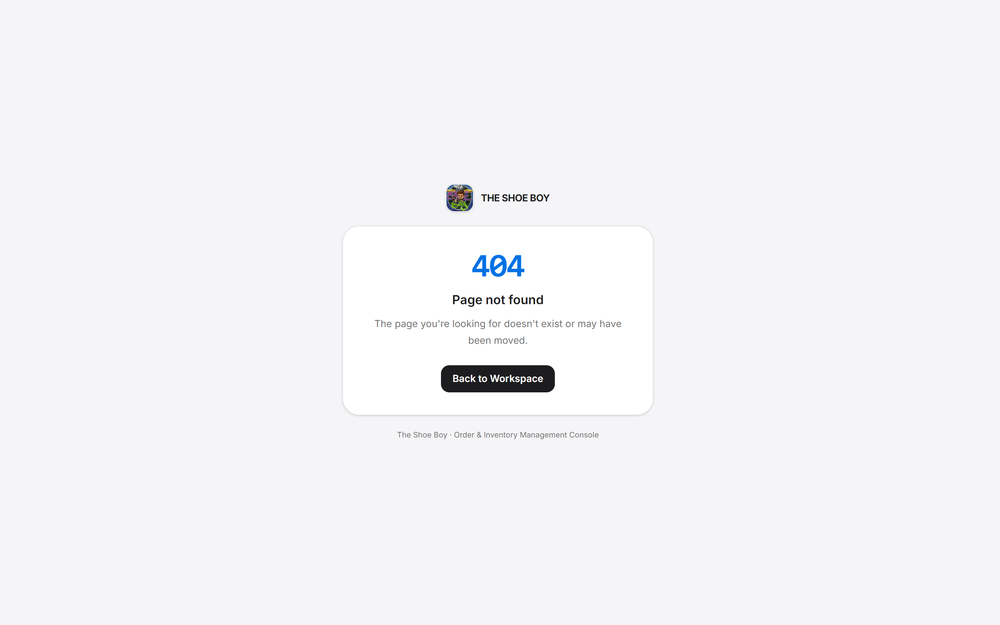 |

---

## 🛠️ Technical Architecture & Stack

| Layer | Technology | Operational Purpose |
| :--- | :--- | :--- |
| **Framework** | Laravel 13 (PHP 8.3+) | MVC core, routing middleware, Eloquent ORM, queued scheduler |
| **Database** | SQLite (MySQL 8+ supported) | Relational storage with cascading constraints and atomic state transitions |
| **Frontend** | Tailwind CSS 4, Alpine.js 3, Blade | Apple-inspired design system, reactive modals/toasts, dark mode |
| **Asset Pipeline** | Vite 8 | HMR in development, bundled/minified production assets |
| **Domain Services** | `OrderService`, `PaymentService`, `ReportingService`, `AuditService` | Fat service layer; thin, testable controllers |
| **Reporting** | Native `XlsxWriter` (OOXML) | Multi-sheet, filterable `.xlsx` financial exports with no external library |
| **Testing** | PHPUnit 12 + `RefreshDatabase` | ~60 feature tests covering business rules, access control, and reporting |
| **Security** | RBAC middleware, throttling, audit logging | Role gating, brute-force protection, accountability trail |

---

## 📅 Project Development Timeline

The design and implementation of The Shoe Boy were executed systematically over a structured timeline following standard SDLC methodology frameworks:

<p align="center">
  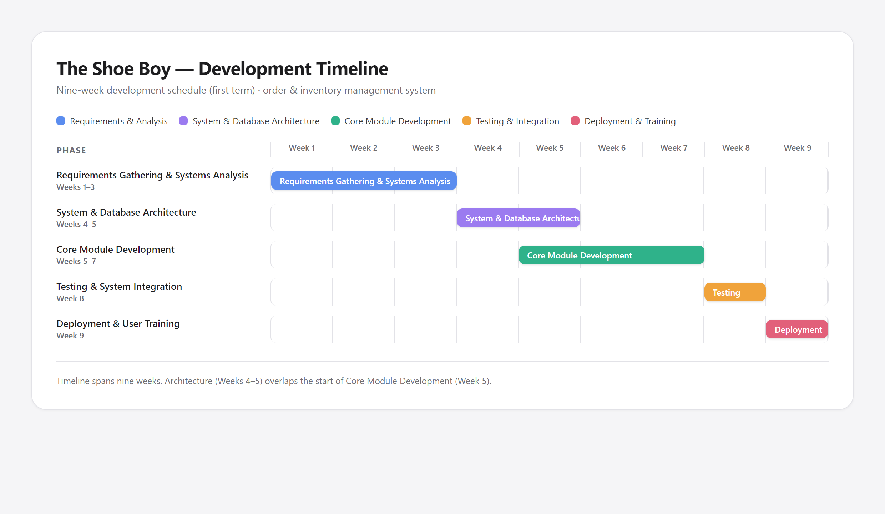
</p>

---

## 📦 System Modules & Feature Scope

### 1. Role-Aware Dashboard & Workspace
* **Owner Executive Center:** Consolidated financial position, net store balance, batch profitability summaries, recent transactions, and a live audit stream.
* **Staff Live Workspace:** A single operational cockpit for live selling — available inventory, active claims, reservation countdowns, pending deliveries, and quick POS access.

### 2. Inventory & Triage (`Items`)
* **Admin Controls:** Full pair-level cataloging (SKU, brand, model, size, condition, repair cost) with automatic **price-tier derivation** from the target price.
* **Triage Workflow:** Track washing / under-repair / available states before a pair is released to the selling floor.
* **Data Integrity:** A pair's status cannot be flipped through the edit form — reservations are only created through real orders.

### 3. Batches & Suppliers
* **Admin Controls:** Record supplier intake as numbered batches (`total_sacks` × `total_pairs` at a `total_cost`), automatically deriving the **per-pair average cost** that drives all profit calculations.
* **Lifecycle Safety:** Soft-deletable and restorable suppliers; batches with linked pairs are protected from deletion.

### 4. Orders & Live Claims (`Orders`)
* **Award Engine:** Award one or many pairs to a buyer in a single transaction, using an **atomic claim** that guarantees a pair is never double-sold — safe even under concurrent live-stream demand.
* **Reservation Ledger:** Every award carries a live **expiry timer**; lapsed reservations are auto-released back to available stock by both a scheduled command and a lazy sweep on workspace load.
* **Status Machine:** `reserved → paid → fulfilled`, with guarded cancellation of unpaid orders.

### 5. Walk-in POS (`orders/pos-checkout`)
* **Counter Sales:** Bundle multiple pairs into one ticket with optional discounts, cash-tendered validation, and instant fulfillment — the delivery record is auto-completed on the spot.

### 6. Payment Verification (`Payments`)
* **Dual Gateways:** Cash and GCash, each recorded with a verifier and timestamp.
* **Fraud Controls:** The verified amount must match the order total exactly, and **GCash reference numbers are globally unique** — rejecting replayed screenshots across orders.

### 7. Deliveries & Fulfillment (`Deliveries`)
* **Channel Routing:** Live-stream orders default to **J&T delivery** (tracking number required and format-validated); POS orders default to pickup.
* **Completion Guard:** A delivery cannot be marked complete for an unpaid order, and a completed delivery is locked from further edits — which transitions the parent order to `fulfilled`.

### 8. Operating Expenses (`Expenses`)
* **Cost Capture:** Category-based expense entries with optional reference numbers and optional batch attribution, feeding the net operating balance.
* **Reversible Deletes:** Soft deletes with a one-tap undo/restore toast.

### 9. Reports & Excel Export (`Reports`)
* **Analytics:** Batch profitability, price-tier margins, per-day session summaries, individual sales ledger, and expense ledger over any date range.
* **Native `.xlsx` export:** A custom OOXML writer produces multi-sheet workbooks with a customizable export builder (choose sections, granularity, and columns).

### 10. Staff & Role Management (`Staff`)
* **Owner-Only Console:** Create and edit staff accounts, toggle access on/off, and manage roles.
* **Middleware Enforcement:** Deactivated accounts are immediately ejected from active sessions at the access gateway.

### 11. Security & Audit Log (`Audit Log`)
* **Immutable Trail:** Every sensitive action — sign-ins, failed sign-ins, awards, cancellations, verified payments, intake, staff/supplier changes, and backups — is recorded with actor, IP, and structured details.
* **Human-Readable:** Automatic descriptions, category badges, and deep links back to the affected record.

---

## 🔒 Reliability & Security Controls

The system treats money and inventory as first-class correctness problems, not just CRUD.

| Control | Implementation |
| :--- | :--- |
| **Atomic claiming** | `OrderService` claims each pair via a single conditional `UPDATE ... WHERE status = 'available'`, race-safe even on SQLite where row locks are no-ops. |
| **Transactional state** | All award, cancel, and payment operations run inside `DB::transaction` with `lockForUpdate` re-reads of the authoritative row. |
| **GCash anti-replay** | A GCash `reference_no` may exist on only one payment in the entire system. |
| **Amount matching** | Verified payment amounts must equal the order total to the centavo. |
| **Reservation expiry** | `shoeboy:release-expired` runs every minute (scheduled) plus a lazy sweep on dashboard load; the client countdown also nudges the server. |
| **One sale per pair** | A DB-unique `order_items.item_id` guarantees a pair belongs to exactly one order. |
| **Brute-force protection** | Login is throttled at `5 attempts / minute`. |
| **RBAC + active gate** | `role:owner` and `active` middleware; deactivated users are logged out mid-session. |
| **Soft deletes** | Expenses and suppliers are restorable, with an undo toast. |
| **Audit logging** | All sensitive events captured with actor, role, IP, and JSON details. |

---

## 🗄️ Database Schema Blueprint

The system uses a normalized relational structure with strict cascading foreign keys to preserve referential integrity across the intake → sale → fulfillment lifecycle.

<p align="center">
  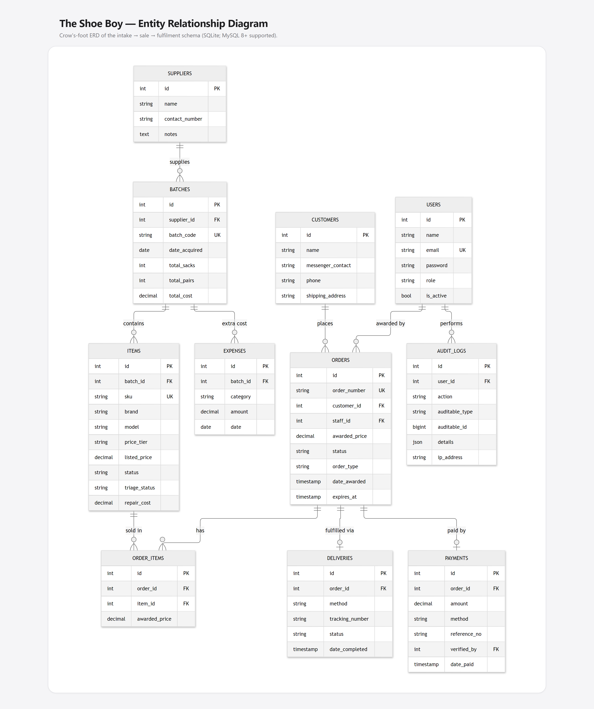
</p>

### 🗄️ System Data Dictionary

| Database Table | Core Responsibility | Key Managed Fields & Structural Elements | System Impact |
| :--- | :--- | :--- | :--- |
| **`users`** | Identity & Access Management | `email` (unique), password, `role` (`owner`/`staff`), `is_active` | Gated by role/active middleware to enter owner consoles or be ejected mid-session when deactivated. |
| **`suppliers`** | Sourcing Partners | `name`, `contact_number`, `notes`, `deleted_at` (soft delete) | Attaches to batches; restorable after soft deletion. |
| **`batches`** | Import Intake (Sacks) | `batch_code` (unique), `total_sacks`, `total_pairs`, `total_cost` | Derives `average_item_cost = total_cost / total_pairs`, the COGS basis for every profit figure. |
| **`items`** | Individual Pair Inventory | `sku` (unique), brand, model, `price_tier`, `listed_price`, condition, size, `status` (`available`/`reserved`/`sold`), `repair_cost` | The atomic claim target; price tier is auto-derived on save; indexed by batch and status. |
| **`customers`** | Buyer Registry | `name`, `messenger_contact` (indexed), phone, shipping address | Groups a buyer's claims/sales across live sessions. |
| **`orders`** | Claim & Sale Ledger | `order_number` (unique), `awarded_price`, `status` (`reserved`/`paid`/`fulfilled`/`cancelled`), `order_type` (`live_stream`/`walkin_pos`), `expires_at` | Drives the reservation timer and the order state machine. |
| **`order_items`** | Order ↔ Pair Pivot | `order_id`, `item_id` (**unique**), `awarded_price` | Enforces the "one sale per pair" rule while allowing many pairs per order. |
| **`payments`** | Verified Receipts | `order_id` (unique), `amount`, `method` (`gcash`/`cash`), `reference_no`, `verified_by`, `date_paid` | Amount must match the order; GCash references are globally unique (anti-replay). |
| **`deliveries`** | Fulfillment Tracking | `order_id` (unique), `method` (`pickup`/`jnt_delivery`), `tracking_number`, `status` (`pending`/`shipped`/`completed`), `date_completed` | Completing a delivery fulfills its parent order; J&T requires a valid waybill. |
| **`expenses`** | Operating Expenses | `batch_id` (nullable), category, `description`, `reference_no`, `amount`, `date`, `deleted_at` | Feeds the net operating balance; soft-deletable and restorable. |
| **`audit_logs`** | Accountability Trail | `user_id`, `action`, `auditable_type`/`auditable_id`, `details` (JSON), `ip_address` | Immutable record of sensitive events, including failed and blocked sign-ins. |

---

## 💻 Local Installation & Setup Guide

Follow these sequential steps to deploy a development replica of The Shoe Boy on your workstation.

### Prerequisites
* **PHP ≥ 8.3** (with `pdo_sqlite`, `zip`, `mbstring`, `openssl`)
* **Composer 2**
* **Node.js 20.19+ / 22.12+ & NPM**
* **Git**
* *(Optional)* MySQL 8+ — SQLite is used by default.

### Step-by-Step Deployment (Windows PowerShell)

1. **Clone the Repository:**
```powershell
git clone https://github.com/clascuna556171/shoeboy.git
cd shoeboy
```

2. **Install Backend Dependencies:**
```powershell
composer install
```

3. **Initialize the Environment:**
```powershell
copy .env.example .env
php artisan key:generate
```

4. **Create the SQLite Database:**
```powershell
New-Item -ItemType File -Path database\database.sqlite -Force
```

5. **Run Migrations & Seed Demo Data:**
```powershell
php artisan migrate --seed
```

6. **Install & Build Frontend Assets:**
```powershell
npm install
npm run build
```

7. **Serve the Application:**
```powershell
php artisan serve
```

Open **http://127.0.0.1:8000**

### Optional: Using MySQL
Update your `.env` before migrating:
```env
DB_CONNECTION=mysql
DB_HOST=127.0.0.1
DB_PORT=3306
DB_DATABASE=shoeboy
DB_USERNAME=root
DB_PASSWORD=
```

### Development with Hot Reload
One command boots the server, queue listener, and Vite together:
```powershell
composer dev
```

### Background Jobs
The reservation sweep runs every minute via the scheduler. In development, run:
```powershell
php artisan schedule:work
```
Ad-hoc database snapshot backup:
```powershell
php artisan shoeboy:backup
```

---

## 🔐 Sandbox Access Profiles

Use these pre-seeded accounts to review both access levels:

| System Domain | Authentication Email | Access Password | Clearance Privileges |
| :--- | :--- | :--- | :--- |
| **Owner Console** | `admin@theshoeboy.com` | `password` | Full access incl. reports, staff, suppliers, and audit log |
| **Staff Workspace** | `staff@theshoeboy.com` | `password` | Live selling, POS, inventory, orders, deliveries, expenses |

---

## 📊 Repository Metrics
<p align="left">


</p>

---

## 👨‍💻 Engineering Team
Developed for the **College of Computing Education**.

* **Christian Lascuña** — IT Lead — [github.com/clascuna556171](https://github.com/clascuna556171)
* **Jheric Kent Japona** — UI/UX, QA — [github.com/JKJapona](https://github.com/JKJapona)
* **Ronald Feliph Dael** — Database, Documentation — [github.com/ronaldfeliph](https://github.com/ronaldfeliph)
* **Professor:** Charisse Barbosa

---
<p align="center">
  Built with ❤️ by The Shoe Boy Engineering Team | 2026
</p>
